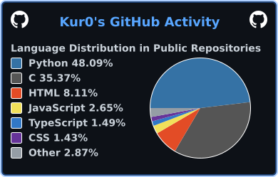

### Hi there 👋

<!--
**jericjan/jericjan** is a ✨ _special_ ✨ repository because its `README.md` (this file) appears on your GitHub profile.

Here are some ideas to get you started:

- 👯 I’m looking to collaborate on ...
- 🤔 I’m looking for help with ...
- 💬 Ask me about ...
- 😄 Pronouns: ...
- ⚡ Fun fact: ...
-->

🌱 Languages I know ...
- Python 🐍
- JS 🗿
- ~~C#~~ I forgor💀
- C++ and Java basics (cuz college)

📫 How to reach me: ...
- Discord: [Kur0#5384](https://discord.com/users/396892407884546058)
- Twitter: [@CantilJan](https://twitter.com/CantilJan)

    

  

